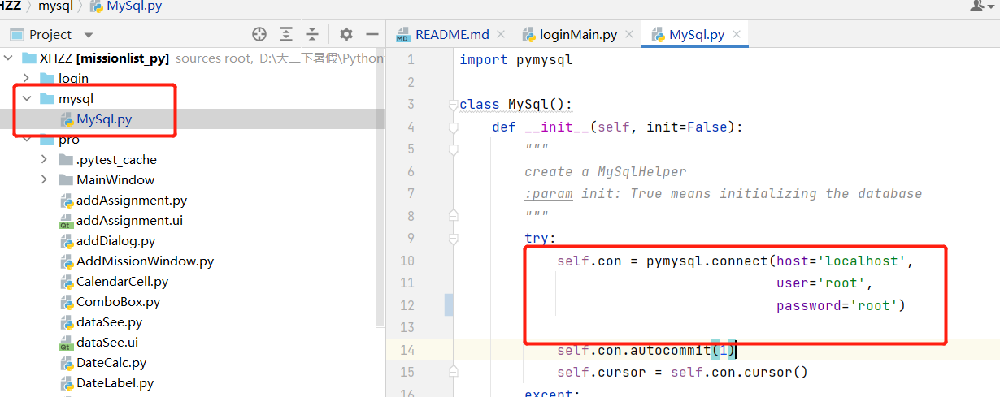

# XIAO HANG ZHUAN ZHU

code for our python homework: Xiao Hang Zhuan Zhu

## prerequirement

- Create a Python 3 environment(3.9), eg using `conda create --name XHZZ python=3.9`
- Activate the environment: `conda activate XHZZ`
- Install the dependency packages: `pip install -r requirements.txt`

## run

- Open the project with a suitable editor, eg `Pycharm`.
- Using the database MySQL, before use, in the `mysql/MySql.py` file, the user and password in the `__init__` method of the `MySql` class should be changed to the corresponding local configuration content.

- run `login/loginMain.py`, then you will see the login screen
- Sign up for a new account and start experimenting later!

